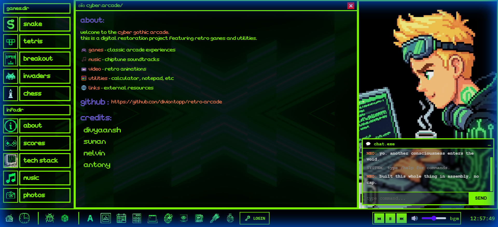

# Retro Arcade Web OS: The Comprehensive Technical Manual

**Version**: 1.0.0
**Status**: Stable / Production
**Author**: Antigravity
**License**: MIT



---

## 📖 Table of Contents

1.  [**Executive Summary**](#1-executive-summary)
2.  [**Architectural Overview**](#2-architectural-overview)
    *   2.1 The React Frontend
    *   2.2 The Python Runtime (Pyodide)
    *   2.3 The Bridge: Inter-Process Communication
3.  [**Installation & Setup**](#3-installation--setup)
    *   3.1 Prerequisites
    *   3.2 Local Development
    *   3.3 Building for Production
4.  [**Project Directory Structure**](#4-project-directory-structure)
5.  [**Component Reference**](#5-component-reference)
    *   5.1 Core Application (`App.tsx`)
    *   5.2 Layout Components
    *   5.3 UI Primitives
    *   5.4 FX & Animations
6.  [**Application Logic (`src/apps/`)**](#6-application-logic-srcapps)
    *   6.1 PyodideRunner (`The Engine`)
    *   6.2 Shell Applications
7.  [**Game Engine Documentation**](#7-game-engine-documentation)
    *   7.1 Tetris: The Super Rotation System
    *   7.2 Snake: Grid Topology
    *   7.3 Breakout: Vector Physics
    *   7.4 Space Invaders: State Machines
    *   7.5 Chess: The Python Engine
8.  [**Services & State Management**](#8-services--state-management)
    *   8.1 AudioBus (Sound Manager)
    *   8.2 ScoreService (Firebase)
9.  [**Styling & Design System**](#9-styling--design-system)
    *   9.1 Design Philosophy
    *   9.2 CSS Variables & Tokens
    *   9.3 Scanlines & CRT Effects
10. [**Troubleshooting & FAQ**](#10-troubleshooting--faq)
11. [**Future Roadmap**](#11-future-roadmap)
12. [**Credits**](#12-credits)

---

## 1. Executive Summary

The **Retro Arcade Web OS** is a high-fidelity web application that simulates a retro-futuristic desktop environment. Unlike traditional websites that use standard page navigation, this project implements a full **Window/Icon/Mouse (WIM)** paradigm.

Users can open multiple applications simultaneously, drag windows, minimize tasks, and execute Python-based arcade games directly in the browser. The aesthetic is heavily inspired by 90s cyberpunk anime (*Serial Experiments Lain*, *Ghost in the Shell*) and early GUI operating systems.

The core technical achievement is the seamless integration of **React** (rendering the UI shell) and **Python/Pyodide** (executing game logic via WebAssembly). This allows for rapid game development in Python while maintaining the responsiveness of a modern React web app.

---

## 2. Architectural Overview

The application is built on a "Hybrid Runtime" model.

### 2.1 The React Frontend (The Body)
*   **Framework**: React 19
*   **Bundler**: Vite (for millisecond HMR speeds)
*   **Language**: TypeScript
*   **Role**: Handles the "OS" layer. It renders the Taskbar, Desktop icons, Window frames, and manages the global state (which windows are open, focused, etc.).

### 2.2 The Python Runtime (The Mind)
*   **Technology**: Pyodide (Python 3.11 compiled to WebAssembly)
*   **Role**: Executes the actual game code. Code is fetched from `.py` files in `public/games/` and run inside the browser.
*   **Isolation**: Each game runs in the main thread (for Canvas access) but is logically isolated in its own namespace scope to prevent pollution.

### 2.3 The Bridge: Inter-Process Communication
This is the critical "Zero-Latency" link between React and Python.

1.  **Input (JS -> Python)**:
    *   We capture `keydown` and `keyup` events in React.
    *   Instead of React handling them, we pass them into a shared `fast_input` object in the Python global scope.
    *   *Code Example*: `window.pyodide.globals.get('fast_input').set_key(code, true)`

2.  **Output (Python -> JS)**:
    *   Python calculates the next frame.
    *   Python calls `js.document.getElementById('canvas').getContext('2d')`.
    *   Python draws pixels directly to the HTML Canvas.

3.  **Audio (Python -> JS)**:
    *   Python cannot play sound directly.
    *   It calls `js.window.triggerSFX('jump')`.
    *   The React `AudioBus` hears this and plays the corresponding MP3.

---

## 3. Installation & Setup

### 3.1 Prerequisites
*   **Node.js**: Version 18.0.0 or higher.
*   **npm**: Version 9.0.0 or higher.
*   **Git**: For version control.
*   **VS Code**: Recommended IDE (with Prettier extension).

### 3.2 Local Development
1.  **Clone the Repository**:
    ```bash
    git clone https://github.com/diviontopp/retro-arcade.git
    cd retro-arcade
    ```

2.  **Install Dependencies**:
    ```bash
    npm install
    # This downloads React, Vite, Typescript, and Pyodide types.
    ```

3.  **Start the Development Server**:
    ```bash
    npm run dev
    ```
    *   Access the site at `http://localhost:5173`.
    *   The server supports Hot Module Replacement (HMR); changes to React files update instantly. Changes to `.py` files require a page refresh (as they are re-fetched).

### 3.3 Building for Production
1.  **Compile**:
    ```bash
    npm run build
    ```
    *   This compiles TypeScript to JavaScript.
    *   It optimizes assets.
    *   It generates a `dist/` folder.

2.  **Preview Build**:
    ```bash
    npm run preview
    ```
    *   Simulates a production server locally.

---

## 4. Project Directory Structure

A comprehensive map of the filesystem.

```text
/
├── public/                     # Static Assets (Served directly)
│   ├── audio/                  # MP3/WAV files for SFX and Music
│   │   ├── playlist.json       # BGM playlist configuration
│   │   └── ...
│   ├── games/                  # PYTHON SOURCE CODE
│   │   ├── tetris/
│   │   │   ├── main.py         # Entry point
│   │   │   └── assets/         # Sprites
│   │   ├── snake/
│   │   ├── breakout/
│   │   └── ...
│   ├── back.mp4                # Background video loop
│   └── icons/                  # Desktop icons (PNG)
│
├── src/                        # REACT SOURCE CODE
│   ├── apps/                   # Application Logic
│   │   ├── LoginApp.tsx        # Login screen logic
│   │   ├── PyodideRunner.tsx   # The Python Game Container
│   │   └── ShellApps.tsx       # Notepad, Calc, etc.
│   │
│   ├── components/
│   │   ├── fx/                 # Visual Effects
│   │   │   ├── Animations.tsx  # Particles, Scanlines
│   │   │   └── ...
│   │   ├── layout/             # Structure
│   │   │   ├── Sidebar.tsx     # Start Menu
│   │   │   ├── Taskbar.tsx     # Bottom Bar
│   │   │   ├── ContentWindow.tsx # Desktop Icons
│   │   │   └── ...
│   │   └── ui/                 # Reusable UI
│   │       ├── WindowFrame.tsx # Critical: Draggable Window
│   │       ├── BootScreen.tsx  # BIOS Sequence
│   │       └── ...
│   │
│   ├── hooks/
│   │   └── usePyodide.ts       # React Hook for Python loading
│   │
│   ├── services/
│   │   ├── AudioBus.ts         # Singleton Audio Manager
│   │   └── firebase.ts         # Database Config
│   │
│   ├── styles/
│   │   └── global.css          # The Design System
│   │
│   ├── App.tsx                 # The OS Kernel / Window Manager
│   └── main.tsx                # Entry Point
│
├── .gitignore                  # Git Exclusion Rules
├── package.json                # Dependencies & Scripts
├── tsconfig.json               # TypeScript Configuration
├── vite.config.ts              # Bundler Configuration
└── README.md                   # This Manual
```

---

## 5. Component Reference

### 5.1 Core Application (`App.tsx`)
This is the root component. It handles:
*   **State**: `windows` (Array of open apps), `isBooting` (Boolean), `isMobile` (Boolean).
*   **Window Manager**:
    *   `openWindow(type)`: checks if a window exists; if not, creates a new object with unique ID.
    *   `bringToFront(id)`: Moves the window to the end of the array (highest Z-index).
    *   `closeWindow(id)`: Filters the window out of the array.
*   **Responsive Logic**: Detects `window.innerWidth` and switches between `grid` (Desktop) and `flex` (Mobile) layouts.

### 5.2 Layout Components
*   **`Sidebar.tsx`**:
    *   Renders the vertical menu on the left.
    *   Iterates through a `GAMES` list to generate launch buttons.
    *   On mobile, it transforms into a horizontal scroller.
*   **`Taskbar.tsx`**:
    *   Displays tabs for currently active windows.
    *   Visualizes the "Minimized" vs "Active" state using CSS grayscale filters.

### 5.3 UI Primitives
*   **`WindowFrame.tsx`**:
    *   Wraps every application.
    *   **Drag Logic**: Uses `onMouseDown`, `onMouseMove`, `onMouseUp` to calculate deltas and update `x,y` position.
    *   **Controls**: Renders the Title Bar, Minimize `_`, and Close `X` buttons.
*   **`BootScreen.tsx`**:
    *   A purely aesthetic component.
    *   Uses `useEffect` timeouts to print lines of "BIOS" text sequentially (e.g., "CHECKING RAM... OK").
    *   Unmounts itself when complete, triggering `App.tsx` to show the desktop.

### 5.4 FX & Animations
*   **`Animations.tsx` (Scanlines)**:
    *   Renders a `div` fixed over the viewport with `pointer-events: none`.
    *   Uses a CSS `repeating-linear-gradient` to simulate CRT phosphor lines.
    *   Adds a subtle vignette (dark corners).
*   **`AnimatedSpriteAvatar.tsx`**:
    *   Renders the character "Inzi" (a 64x64 sprite).
    *   Cycles background-position to animate "Idle", "Wave", or "Sleep" states.

---

## 6. Application Logic (`src/apps/`)

### 6.1 PyodideRunner (`The Engine`)
Located in `src/apps/PyodideRunner.tsx`. This file is the bridge.
**Lifecycle**:
1.  **Mount**: Checks if `window.pyodide` is ready.
2.  **Fetch**: Downloads `public/games/{game}/main.py`.
3.  **Execute**: Runs `pyodide.runPython(code)`.
4.  **Loop**: Python registers a `loop()` function. React starts a `requestAnimationFrame` loop that calls `loop()`.
5.  **Unmount**: Cleans up the canvas and kills the Python loop.

### 6.2 Shell Applications
*   **`TerminalApp`**: A simulated command prompt. It parses text strings input by the user.
    *   supported commands: `help`, `clear`, `ls`, `echo`.
*   **`NotepadApp`**: A simple text editor. Uses `localStorage` to save notes between sessions.

---

## 7. Game Engine Documentation

### 7.1 Tetris: The Super Rotation System
**File**: `public/games/tetris/main.py`
The most complex game in the suite.
*   **Grid**: Standard 10 columns x 20 rows.
*   **Shapes**: stored as lists of coordinate offsets `[(0,0), (-1,0), (1,0), (0,-1)]`.
*   **Gravity**:
    *   Implemented via a `fall_timer`.
    *   `GRAVITY_TABLE` defines frames-per-drop per level. Level 1 = 48 frames, Level 29 = 1 frame.
*   **SRS (Super Rotation System)**:
    *   Standard rotation formula: `x' = -y`, `y' = x`.
    *   Includes Wall Kicks: If a rotation fails (hits wall), we try shifting the piece `+1x`, `-1x`, `+1y`, etc., until it fits.
*   **Scoring**:
    *   Standard line clears (100, 300, 500, 800).
    *   Multipliers for **Level** (`score * level`).
    *   Level Up Event: Occurs every 2 lines cleared.

### 7.2 Snake: Grid Topology
**File**: `public/games/snake/main.py`
*   **Topology**: The game world is a grid. Coordinates are integers `(0..20, 0..15)`.
*   **Movement**:
    *   The "Head" moves in `current_direction`.
    *   The "Body" follows the path of the head.
    *   Implemented using a Queue structure (Add head, Remove tail).
*   **Input Handling**: A "Move Queue" prevents suicide. If you press "Up" then "Left" quickly, they are queued so you don't turn 180 degrees instantly and die.

### 7.3 Breakout: Vector Physics
**File**: `public/games/breakout/main.py`
*   **Ball Physics**:
    *   Positon: `x, y` (Float).
    *   Velocity: `vx, vy` (Float).
*   **Reflection Math**:
    *   When hitting a brick, we check the overlap depth.
    *   If `overlap_x < overlap_y`, we hit the side -> Flip `vx`.
    *   If `overlap_y < overlap_x`, we hit top/bottom -> Flip `vy`.

### 7.4 Space Invaders: State Machines
**File**: `public/games/spaceinvaders/main.py`
*   **Enemy Logic**:
    *   The enemies move as a *single unit*.
    *   **State 1 (March Right)**: `x += speed`.
    *   **State 2 (Edge Hit)**: `y += drop_distance`, switch direction.
    *   **State 3 (March Left)**: `x -= speed`.
*   **Projectiles**: Simple objects moving `y -= speed` (player) or `y += speed` (enemy).

### 7.5 Chess: The Python Engine
**File**: `public/games/chess/engine.py` (Logic), `main.py` (Graphics)
*   **Move Generation**:
    *   The engine iterates every square.
    *   If piece exists, call helper `get_{piece}_moves(x, y)`.
*   **Checkmate Code**:
    *   Is the King in check?
    *   Do any valid moves exist?
    *   If Yes/No -> Check.
    *   If Yes/No -> Checkmate.
    *   If No/No -> Stalemate.

---

## 8. Services & State Management

### 8.1 AudioBus (Sound Manager)
**File**: `src/services/AudioBus.ts`
*   **Purpose**: Browsers block auto-playing audio. The `AudioBus` manages this restriction.
*   **Implementation**: Singleton Pattern.
*   **Channels**:
    *   `sfx`: Sound effects (shot, jump). multiple can play at once (polyphony).
    *   `bgm`: Background music. Only one track loops.
*   **Unlock**: On the first user click, `AudioContext.resume()` is called.

### 8.2 ScoreService (Firebase)
**File**: `src/services/ScoreService.ts`
*   **Backend**: Google Firebase Firestore.
*   **Schema**: `scores` collection -> `{ user: string, score: number, game: string, timestamp: date }`.
*   **Security**: Rules configured to allow public reads, authenticated writes (or anonymous for this demo).

---

## 9. Styling & Design System

### 9.1 Design Philosophy
"Retro-Futurism". The UI should look like a computer from a 1990s sci-fi movie.
*   **Colors**: High contrast. Black backgrounds, Neon Green/Cyan text.
*   **Typography**:
    *   Headers: "Press Start 2P" (Pixelated, Blocky).
    *   Terminal Text: "VT323" (Monospace, Scanline-friendly).

### 9.2 CSS Variables & Tokens
Defined in `src/styles/global.css`:
```css
:root {
  --primary: #00ff41;    /* The Matrix Green */
  --secondary: #008f11;  /* Darker Green */
  --accent: #d600ff;     /* Cyberpunk Pink */
  --bg-color: #0d0208;   /* Vantablack */
  --glass: rgba(0, 20, 0, 0.7); /* Translucent Windows */
}
```

### 9.3 Scanlines & CRT Effects
A crucial part of the aesthetic.
*   **Scanlines**: Created using `repeating-linear-gradient(to bottom, transparent 50%, rgba(0,0,0,0.5) 50%)`.
*   **Flicker**: A CSS `@keyframes` animation slightly adjusts opacity by 0.05 alpha every few seconds.

---

## 10. Troubleshooting & FAQ

**Q: The game doesn't load?**
*   **A**: Check your internet. Pyodide must download the Python runtime (about 6MB) on the first load.

**Q: Sound isn't playing?**
*   **A**: Browsers block audio until you interact. Click anywhere on the page to "unlock" the Audio Context.

**Q: "Module Not Found" in Python?**
*   **A**: We are using the standard Python library. You cannot import external pip packages (like `pygame` or `numpy`) unless they are explicitly loaded in `usePyodide.ts`.

**Q: Mobile controls are too small?**
*   **A**: The layout is responsive. Ensure you are in landscape mode for the best experience, though portrait works for simple tasks.

---

## 11. Future Roadmap

1.  **Multiplayer Support**: Using WebSockets to sync game states between browsers.
2.  **More Games**: Pac-Man, Doom (via WASM/DosBox integration).
3.  **File System Persistence**: Use the File System Access API to let users save "files" to their real hard drive.
4.  **Theme Engine**: Allow users to switch between "Matrix Green", "Cyberpunk Pink", and "Amber Retro".

---

## 12. Credits

*   **Lead Engineer**: Antigravity
*   **Frameworks**: React, Vite, Pyodide
*   **Assets**:
    *   Icons: RemixIcon / FontAwesome
    *   Fonts: Google Fonts
    *   Sound Effects: Mixkit / Freesound.org (Creative Commons)

---
*End of Documentation*
