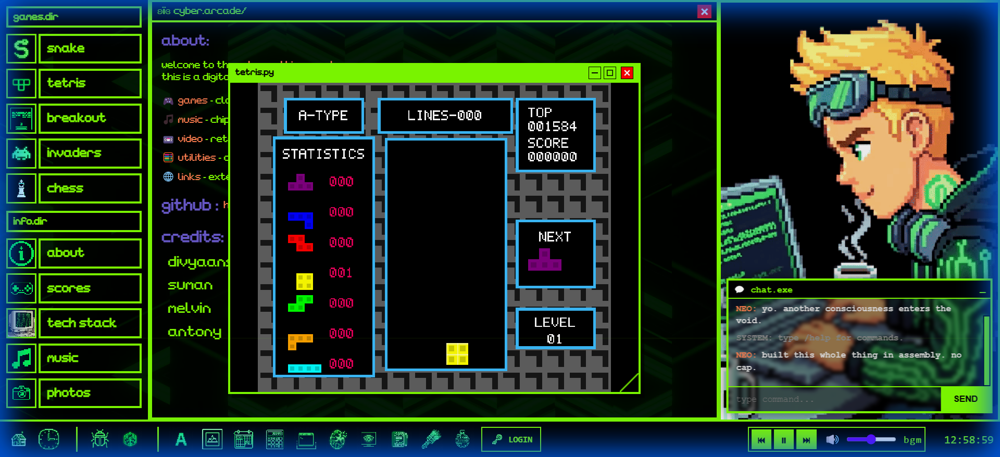

# Retro Arcade Web OS

Welcome to the **Retro Arcade Web OS**! This is a special website that looks and feels like a futuristic computer from the 90s (think *The Matrix* meets *Windows 95*). It runs classic arcade games like Tetris and Snake right inside the browser, but it's built with modern technology.

## 🌟 What is this?

Imagine if you could open a web page and instead of a boring scrollable wall of text, you got a full computer desktop. That's what this project is.
*   **It's an Operating System:** You can open windows, drag them around, minimize them, and multitask.
*   **It's a Game Console:** You can play games that are programmed in **Python**, running instantly in your browser.
*   **It's Alive:** Backgrounds move, scanlines flicker like an old TV, and there's a little helper bot named "Inzi" who watches you play.

## 🚀 How It Works (For Beginners)

Normally, websites are built with **JavaScript**. However, our games are written in **Python** (a popular coding language for data and AI).
To make Python run in a browser, we use a magic tool called **Pyodide**.

1.  **The "Shell" (React)**: The windows, taskbar, and buttons are built with React. This is the visual interface.
2.  **The "Engine" (Pyodide)**: When you open a game, we start a tiny Python computer inside your browser tab.
3.  **The Bridge**: When you press a key (like "Space"), React sends a message to Python saying "Jump!". Python calculates the physics and sends back a message saying "Draw the player at position X,Y".

## 🎮 The Games

### 1. Tetris

The classic block-stacking game.
*   **Controls**:
    *   `Arrow Keys`: Move Left/Right
    *   `W` or `Up`: Rotate Clockwise
    *   `Z`: Rotate Clockwise
    *   `Space`: Hard Drop (Instant lock)
*   **Features/Rules**:
    *   **Level Up**: You advance a level every **2 Lines** cleared. The game gets faster!
    *   **Scoring**: You get bonus points for "Combos" (clearing lines back-to-back).

### 2. Snake
Eat food, grow longer, don't hit the walls.
*   **Controls**: Arrow Keys.

### 3. Breakout
Bounce the ball to break all the bricks.
*   **Features**: Different levels have different brick patterns (Pyramids, Checkerboards).

### 4. Chess
A full chess game against... yourself (for now).
*   **Engine**: Written completely in Python. It knows all the rules: Castling, En Passant, and Checkmate.

### 5. Space Invaders
Defend Earth from the alien march.
*   **Controls**: `Space` to shoot.

---

## 📂 Project Structure (Where is everything?)

If you want to understand the code, here is a map of the most important files.

### 1. The "Visuals" (React)
These files control how the website **looks**.
*   `src/App.tsx`: The "Main Brain". This controls the entire desktop, handles opening/closing windows, and deciding if you are on Mobile or Desktop.
*   `src/components/layout/Sidebar.tsx`: The menu on the left (Start Menu). This is where the buttons to launch games live.
*   `src/components/ui/WindowFrame.tsx`: This is the code for a "Window". It handles the title bar, the "X" button, and the dragging logic.
*   `src/apps/PyodideRunner.tsx`: **The most important file**. This is the specialized "Window" that runs Python games. It loads the game code and creates the screen for the game to draw on.

### 2. The "Games" (Python)
These files control how the games **play**. They are located in `public/games/`.
*   `public/games/tetris/main.py`: The entire code for Tetris.
    *   It defines the blocks (Shapes T, L, Z, etc.).
    *   It handles the logic for "Collision" (can I move here?).
    *   It handles the scoring and leveling up system.
*   `public/games/snake/main.py`: The Snake logic.
*   `public/games/chess/engine.py`: The brain of the Chess game. It calculates valid moves.

### 3. The "Styles" (CSS)
*   `src/styles/global.css`: This file contains all the colors, fonts, and animation rules. It defines the "Neon Green" look and the "Scanline" monitor effect.

---

## 🛠️ How to Run This Yourself

If you have this code on your computer, here is how you start it:

1.  **Install the Tools**: You need `Node.js` installed.
2.  **Open Terminal**: Open a command prompt in this folder.
3.  **Install Dependencies**: Type `npm install` and hit Enter. This downloads all the libraries we need.
4.  **Start the Engine**: Type `npm run dev`.
5.  **Launch**: Open your browser to `http://localhost:5173`.

## 📝 Authors & Credits
*   **Concept & Code**: Antigravity
*   **Assets**: Uses "Press Start 2P" font from Google Fonts.

---
*Note: This documentation excludes internal build scripts and the raw source concatenation file (`printable_code.txt`) to keep things clean.*
